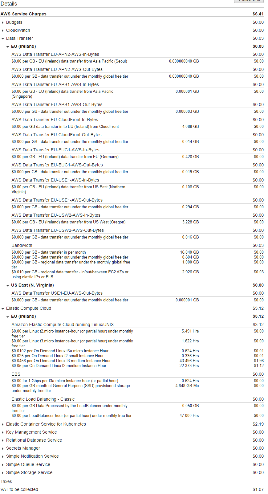

# Final-Project-Team3

## Pet-Clinic Web Application
### Contents
1. [Executive Summary & Critical Review](#Executive-Summary-&-Critical-Review)
    * Aim  
    * Our Method
    * Summary

2. [Project Tracking](#Project-Tracking)
    * Initial sprint 
    * Final sprint 

3. [Risk Assessment](#Risk-Assessment)

4. [Technologies used](#Technologies-used)
    * Technology comparisons

5. [Architecture](#Architecture) 
    * sevrice architectrue diargram 
    * CI Pipeline
    * Technology comparisons

6. [Deployment](#Deployment)
    * Toolset
    * CI Server Implementation
    * Security
    * Branch and Merge Log

7. [Testing](#Testing)

8. [Conclusion](#conclusion)
    * Identified Issues
    * Future Improvements

8. [Set up guide](#Set-up-guide)

9. [Acknowledgements](#Acknowledgements)
    * Author
    * License

---
## Executive Summary & Critical Review
### Aim 
The aim of this group project was to plan, design and implement a solution for automating the development workflows and deployments of two external applications. 
* Spring-Petclinic-Angular - frontend Client of the application, Developed with angular js
* Spring-Petclinic-Rest - backend API of the application, Developed with Java.

Upon Deployment a set of predefined objectives regarding what we have learnt must be considered.

* What resources/services will work best for the deployment with clear comparison and justification.
* Multiple environment support in order for a developer to test new features before merging to the main branch.
* Deployment of a robust system. This will allow improvements to be made without destroying the application and effecting the experience of the user.
* Overall cost of Deployment will be documented using monthly estimates. Along this this how the Deployment can be made more efficiently. 
### Our Method
The External applications work in a way that the frontend will communicate with the backend and request data. this data is then displayed on the frontend page. For this to work the group has utilised the following architecture.
* IAAS - Terraform to create the AWS ecosystem and Configure the environment of the Virtual machines.
* EKS to orchestrate the containers which will run the applications.
* CI Server - Jenkins functioning as pipeline with Webhooks from the version control GIt Hub, to trigger builds.

---
## Project Tracking

**Intial trello board :**

In the intial trello this was one of the first things completed for the project along with the github repository in this image you can see how we have split up tasks between MOSCOW and you can also see the tasks being completed and the ones that are completed.

**Trello board after 2nd interval :**

In the second interval you can see that more tasks have been completed since the last interval and you can also see that there tasks that have been added to the in progress part of the trello

**Trello board after 3rd interval :**

we included a new column for issues with the project so that these could be seen by the group and therefore be able tackle more specific issues with development 

**Final Trello Board :**

[Sprint-Log](https://github.com/BlakeLewis1/final-project/blob/dev/Documents/Sprint%20Backlog.pdf)

Above is a link to our sprint backlog which has a rough example of what our sprints looked like and the time designated for the sprints are also available in this document.

---
## Risk Assessment
[RA](https://github.com/BlakeLewis1/final-project/blob/dev/Documents/Project%20RA%20-%20Sheet1.pdf)

linked above is the risk assessment for the project for ease of viewing it is reccomended that you download the file.

This risk assessment displays the different possible risks that could occur during the development of our project the assessment is to be updated at different  time  intervals whilst developing our solution to be able to give an insight of how each risk progressed we have added a risk level which essentially is a sum of (**liklihood**) the possibility of the risk happening and (**impact**) the damage level the risk would have on the project if it did occur.

**initial interval 02/07/20 ~ 04/07/20**

| Risk              | Risk Statment | Response Stratergy                                                                  | Objective                                         | likelihood   | Impact      | Risk Level |
| :---------------- | :------------ | :---------------------------------------------------------------------------------- | :------------------------------------------------ | :---------: | :---------: | :--------: |
| Kubernetes networking unsuccessful| The application wouldn't be able to deploy      | understand how k8s works                                                           | kubernetes enables the app to run                         | 80%   | High     | 90%         |
| Exceeding the budget    | the resources used cost money to run    | use cost effective resources for deployment                               | keep the cost of deployment low                  | 50% | High        | 60%       |
| Exceeding the time limit  | If we go over the time limit then the project will not pass   |Use the scrum feature of sprints to complete tasks                  | Split work up into intervals            | 25%     | High      | 30%    |
| Exposed keys     | if keys are exposed , unauthorised access could occur   | maintain that best practises are used for version control    | maintain that best practises are used   | 70%| High        | 80%        |
| Branch conflicts       | too many merge conflicts and deployment will be halted    | push working versions of code on to the master                  | make use of the branch feature in github correctly                 | 60%      | High     | 70%          |
| Jenkins password exposed | if jenkins is exposed the app would be vunerable     | use best practices to keep passwords secure                              | ensure password is not exposed          | 40%    | High      | 50%          |
| AWS sever exposed     | if exposed there is a risk that the app could be deleted     | make sure users with access are authorised                                        | Make IAM Users for team members only   | 20%     | High       | 25%          |
|  Docker images not updating  | if it happens the rolling update isnt working   | make sure that docker images are updated  | app works correctly with data          | 70%      | High        | 80%         |
| Jenkins pipeline   | if this occurs the app wont run correctly     | add a github webhook | Have a webhook that works   | 40%    | High     | 50%         |
| Subnet cidr id taken  | if this occurs the app wont work    | use a distinctive cidr id                    | make sure the eks cluster is able to communicate   | 60%   | High        | 70%         |
|

**2nd Interval 04/07/20 ~ 06/07/20**

| Risk              | Risk Statment | Response Stratergy                                                                   | Objective                                         | likelihood   | Impact      | Risk Level |
| :---------------- | :------------ | :---------------------------------------------------------------------------------- | :------------------------------------------------ | :---------: | :---------: | :--------: |
| Kubernetes networking unsuccessful| The application wouldn't be able to deploy      | understand how k8s works                                                           | kubernetes enables the app to run                         | 70%   | High     | 80%         |
| Exceeding the budget    | the resources used cost money to run    | use cost effective resources for deployment                               | keep the cost of deployment low                  | 40% | High        | 50%       |
| Exceeding the time limit  | If we go over the time limit then the project will not pass   |Use the scrum feature of sprints to complete tasks                  | Split work up into intervals            | 10%     | High      | 10%    |
| Exposed keys     | if keys are exposed , unauthorised access could occur   | maintain that best practises are used for version control    | maintain that best practises are used   | 50%| High        | 60%        |
| Branch conflicts       | too many merge conflicts and deployment will be halted    | push working versions of code on to the master                  | make use of the branch feature in github correctly                 | 40%      | High     | 50%          |
| Jenkins password exposed | if jenkins is exposed the app would be vunerable     | use best practices to keep passwords secure                              | ensure password is not exposed          | 30%    | High      | 35%          |
| AWS sever exposed     | if exposed there is a risk that the app could be deleted     | make sure users with access are authorised                                        | Make IAM Users for team members only   | 10%     | High       | 10%          |
|  Docker images not updating  | if it happens the rolling update isnt working   | make sure that docker images are updated  | app works correctly with data          | 60%      | High        | 70%         |
| Jenkins pipeline   | if this occurs the app wont run correctly     | add a github webhook | Have a webhook that works   | 40%    | High     | 50%         |
| Subnet cidr id taken  | if this occurs the app wont work    | use a distinctive cidr id                    | make sure the eks cluster is able to communicate   | 55%   | High        | 65%         |
|

**3rd Interval 06/07/20 ~ 08/07/20**

| Risk              | Risk Statment | Response Stratergy                                                                   | Objective                                         | likelihood   | Impact      | Risk Level |
| :---------------- | :------------ | :---------------------------------------------------------------------------------- | :------------------------------------------------ | :---------: | :---------: | :--------: |
| Kubernetes networking unsuccessful| The application wouldn't be able to deploy      | understand how k8s works                                                           | kubernetes enables the app to run                         | 60%   | High     | 70%         |
| Exceeding the budget    | the resources used cost money to run    | use cost effective resources for deployment                               | keep the cost of deployment low                  | 30% | High        | 35%       |
| Exceeding the time limit  | If we go over the time limit then the project will not pass   |Use the scrum feature of sprints to complete tasks                  | Split work up into intervals            | 10%     | High      | 10%    |
| Exposed keys     | if keys are exposed , unauthorised access could occur   | maintain that best practises are used for version control    | maintain that best practises are used   | 40%| High        | 50%        |
| Branch conflicts       | too many merge conflicts and deployment will be halted    | push working versions of code on to the master                  | make use of the branch feature in github correctly                 | 20%      | High     | 25%          |
| Jenkins password exposed | if jenkins is exposed the app would be vunerable     | use best practices to keep passwords secure                              | ensure password is not exposed          | 10%    | High      | 10%          |
| AWS sever exposed     | if exposed there is a risk that the app could be deleted     | make sure users with access are authorised                                        | Make IAM Users for team members only   | 50%     | High       | 60%          |
|  Docker images not updating  | if it happens the rolling update isnt working   | make sure that docker images are updated  | app works correctly with data          | 70%      | High        | 80%         |
| Jenkins pipeline   | if this occurs the app wont run correctly     | add a github webhook | Have a webhook that works   | 50%    | High     | 60%         |
| Subnet cidr id taken  | if this occurs the app wont work    | use a distinctive cidr id                    | make sure the eks cluster is able to communicate   | 30%   | High        | 40%         |
| 

**Final Interval 08/07/20 ~ 10/07/20**

| Risk              | Risk Statment | Response Stratergy                                                                 | Objective                                         | likelihood   | Impact      | Risk Level |
| :---------------- | :------------ | :---------------------------------------------------------------------------------- | :------------------------------------------------ | :---------: | :---------: | :--------: |
| Kubernetes networking unsuccessful| The application wouldn't be able to deploy      | understand how k8s works                                                           | kubernetes enables the app to run                         | 10%   | High     | 10%         |
| Exceeding the budget    | the resources used cost money to run    | use cost effective resources for deployment                               | keep the cost of deployment low                  |20% | High        | 40%       |
| Exceeding the time limit  | If we go over the time limit then the project will not pass   |Use the scrum feature of sprints to complete tasks                  | Split work up into intervals            | 10%     | High      | 10%    |
| Exposed keys     | if keys are exposed , unauthorised access could occur   | maintain that best practises are used for version control    | maintain that best practises are used   | 20%| High        | 30%        |
| Branch conflicts       | too many merge conflicts and deployment will be halted    | push working versions of code on to the master                  | make use of the branch feature in github correctly                 | 10%      | High     | 10%          |
| Jenkins password exposed | if jenkins is exposed the app would be vunerable     | use best practices to keep passwords secure                              | ensure password is not exposed          | 10%    | High      | 10%          |
| AWS sever exposed     | if exposed there is a risk that the app could be deleted     | make sure users with access are authorised                                        | Make IAM Users for team members only   | 10%     | High       | 10%          |
|  Docker images not updating  | if it happens the rolling update isnt working   | make sure that docker images are updated  | app works correctly with data          | 30%      | High        | 40%         |
| Jenkins pipeline   | if this occurs the app wont run correctly     | add a github webhook | Have a webhook that works   | 10%    | High     | 10%         |
| Subnet cidr id taken  | if this occurs the app wont work    | use a distinctive cidr id                    | make sure the eks cluster is able to communicate   | 10%   | High        | 10%         |
| 

This risk assessment displays the different possible risks that could occur during the development of our project the assessment is to be updated at different  time  intervals whilst developing our solution to be able to give an insight of how each risk progressed we have added a risk level which essentially is a sum of (**likelihood**) the possibility of the risk happening and (**impact**) the damage level the risk would have on the project if it did occur.

we also ensured that we revisited the risk assessment and addressed any clear issues in the development one instance of this is when we revisited the cidr block risk and came up with a solution for it in the 3rd interval of the project which saw the liklihood fall dramatically.

---
## Architecture

### architecture design 
**initial architecture design**

**final architecture design**

we had to change our initial design to make sure that the database was able to be displayed correctly through the front end of the app to do this we employed a new solution for the app. Due to the competitiveness of today's cloud marketplace. so we incuded a gcp database instaed of a a aws rds. we thought having a multi provider approach using both AWS and GCP resources would showcase flexibility of the business opportunities group 3 can provide. along with this the intial design was to have a bastian host. 

In the final design we got rid of the bastian host and made the worker node also the jenkins machine due the time constraints and having increase the computing power of the ec2 machine.

### Technology comparisons

**terraform**

For provisioning architecture we used terraform as its Open source, works across 100s of providers and has great documentation. Terraform plan was used to identify syntax errors and display a detailed plan of the resources to be created. We utilised modules to avoid duplication of code. We also used terraform to employ a multi provider approach with  both aws resources and a gcp database used. This shows how easy terraform makes it to migrate resources from one provider to another. We also deployed our app into subnets within multiple availability zones for increase redundancy.

**kubernetes**

The reason we chose to use kubernetes is due to its advanced monitoring and ability to manage and scale up large clusters of pods. Kubernetes manages nodes and performs constant health checks and reboot of failing pods. EKS can easily perform rolling updates with no downtime.  Due to the benefits large organisations all use it over docker swarm. Downside we had very little experience and understanding of pod communication and service types. 
In addition to this another reason why we decided to use kubernetes over docker swarm was that it was easier to update images by using kubectl apply to make updates to the image whilst with docker you would be required to build the image using docker image build  which would take up time rebuilding the image.

**Jenkins_Pipeline**

Jenkins pipeline

We have chosen to use Jenkins due to personal preference and also due to the benefits of using a Jenkins file.

Jenkinsfile benefits include:
Code review/iteration on the Pipeline
Audit trail for the Pipeline

Stage 1
Make script files executable:
A crucial script for a jenkinsfile without this it would not be able to run the following stages 

Stage 2 
Prepare Environment:
The first steps of stage 2 are installing docker and kubernetes. The jenkinsfile could of been made more efficient by using the terraform user data to install docker and kubernetes.
The robust.sh script turns the most recent commit to the dev branch triggered by the webhook into docker images and pushes them up to docker hub ready to be called down by kubernetes.
Stage 3
Test Environment
The backtest.sh script is the only test run in stage 3 due to time constraints we were unable to implement testing for the front end. 
It's a simple script that changes into the backend directory, installs maven and runs the built in mvn test for the backend application. The results of the test can be viewed in the logs of the build.

Stage 4
Deploying with kubernetes
The final stage is 1 script but is the most important part of the pipeline.
The first step executes the .bashrc file which exports all of the necessary environment variables
It then installs mysql-client-core-8.0 which is necessary for the next 2 steps
The first mysql command in the script runs the initDB.sql file which creates the database and the tables
The second sql command runs the populateDB.sql file which fills the sql tables with data
The script then runs a kubectl apply on the frontend, backend and nginx yamls which brings up the application with terraform

---
## Deployment
The Ci Pipeline and Process chain diagram showcased below represent a deployment strategy after the application has already be developed and handed over to the DevOps Engineers.

The diagram above, displays the deployment of our project. 

Jenkins. A Pipeline build triggered by the version control system Github, initiates the process of which the final stage of the build will deploy the applications using Amazons elastic Kubernetes services. 

Eks. The Eks Cluster has three separate Deployments, frontend application, backend application, and NGINX. The NGINX will work as a Load balancer within the EKS cluster, directing all traffic to the front end of the application.

An multi provider approach was considered due to the competitiveness of todays cloud marketplace. This was completed by utilising an GCP Mysql database and Aws resources applied by terraform. This skillset showcases flexibility of the business opportunities group3 can provide.

To elaborate on some of the technologies used in the CI pipeline is as follows:

* Microsoft Teams - to host our Daily Scrums.
* Trello - Project Tracking tool. This tool was used to create our sprints and allow the team to keep up to date with what work is being done.
* Terraform - to create the aws ecosystem along with a GCP Mysql Database. 
* Trello board to keep track of the project progress.
* GitHub: allows the source code to be stored and also webhooks are created which trigger the Ci server to build the pipeline and run the application.
* Jenkins
* Maven - test the backend application using the pre-configured test files.
* Docker - containerises our application.
* EKS - orchestrates the container created by docker. which then deploys the application.
* AWS - hosting our resources and enabling monitoring so that the group can be emailed alarmed.

---
## Testing

Testing for the backend was built into the Jenkins pipeline. We run a mvn test which is then displayed in Jenkins logs where it can be checked for any errors.

Due to time constraints and concern for wasting machine resources the built-in testing for the frontend was not implemented into Jenkins.

We encountered an issue when it came to implementing automated testing with the front-end application as it required human interaction to run the debugger. Therefor running the ng test command seems like a waste of resources as automation is the goal of the project. 

---
## Monitoring
For the project we looked at our budget and decided it would be beneficial to enable advanced monitoring in AWS cloud watch for our EC2. This enabled us to setup alerts that would constantly monitor the machine. Whenever an alarm is triggered an email is sent too everybody in the group lowering the risk of the alarm being missed.
We setup 2 alarms for our EC2 instance

This alarm would trigger if cpu utilization of the machine exceeds 75% which should be very unlikely due to the workload being balanced between multiple machines

This alarm was created to warn everyone if the machine powers off for longer than 1 minute unexpectedly.

---

## Cost analysis
#### Total Costs

we started off with deciding which resources were going to be required for the project and also took into consideration the cost  of each resource consequently we had to research different methods to complete things and we analysed using this research what was going to be the most cost effective method and the forecasted costs chart shows that our deployment method will be under the £20 budget that QA had setup for us in the beginning of the project 

The eks was one of the biggest costs for the project at the time of writing the EKS cluster has been running for 22 hours and was 34.2% of our total expense. If the website was receiving more requests it would definitely become the most expensive service used in the application.

Due to the application utilising the EKS service the free tier t2.micro cpu was not suitable. Therefore the EC2 instances ended up being our largest expense at 48.7% of total cost.
Total cost for EC2:

As you can see above the EKS creates 2 t3 medium instances and 1 t2 medium instance. The t3 medium was the most expensive resource as of writing.

In conclusion after analysing the costs it's clear that the cost of this project could have been reduced if we used the ingress method, however we had already experimented with this and attempted at the start to implement this method but it became too complex and could have led to the project not being completed within time.

#### Expected Cost

As you can see above the expected cost for the rest of the month at the time of writing (July 09) is $13.81. However we believe this prediction is inaccurate as during development the machines have been turned off over night and the project was started a few days into the month making the overall estimate inaccurate.

---
## Conclusion
In conclusion as a team we have been able to utilise the agile methodology and also the scrum 
framework to successfully build our deployment for the pet clinic app. Examples of this include 
starting every day with a daily scrum meeting and used sprint retrospectives at the end of the sprints and deciding upon actions for the next iteration therefore sticking to the scrums incremental nature.We also held mini sprint reviews to show how much progress was being made with the project.

 After holding our final sprint retrospective provided evidence that using the scrum framework has enabled the group to be able to work efficiently by using sprints that were used to set out in sprint planning.

whilst completing the project their were issues that we came across these were therefore added to the trello board in the form of issues however these were effectively our product backlog artifact, consequently this was to ensure that the team were aware of them and therefore were able to tackle these specific issues this helped the team to work more effectively 

What we would do better in the future I would have liked to have the backlog properly documented in the README.md and be able to work

---
## ISSUES 

**Issue1**

EC2 configuration – using an T2 micro and ubuntu 16 image. The ram of the machine used was to small and the version of the ubuntu was out dated to install the correct software to run/build the docker images for both the back end and front application.

Fix 

We increased the size of the machine to a t2 medium with 2CPU. Along with this we used an ubuntu 18 Ami image. This resulted in not only being able to build/run the application but install the software faster. The major benefit was the group was able to use this EC2 as the Jenkins machine and also the manager node in the eks cluster.

**Issue 2.**

EKS not working. Some of the reasons for this was as following:

The nginx service which was deployed by the cluster. This service works as a load balancer and the load balancer it self could not find the worker nodes in the cluster in the specified availability zones. The incorrect images was being pulled down by git hub.

Fix .

The terraform subnets had to use a different cidr block as the current cidrs was taken. It was changed from 10.0… to 10.50. after this the load balancer could find the worker nodes that had been deployed. Docker images had to be re built and pushed to the docker repository. Along with this the image had to have been built with the correct environment variable exported.

**Issue 3.**

Jenkins pipeline build – the build would not allow the EKS to deploy the Kubernetes yamls into the cluster.

Fix – we had to run the command aws configure inside Jenkins so thath jenkis had access to the AWS consol. A separate Jenkins user was created.

**Issue 4.**

Terraform not being able to destroy AWS resources. 

Without having te correct permission some resources could not be deleted unless the action was done by the root user. The main reason was because some resources depend on others for example the RDS database utilises a network which was connect to the rest of the architecture.

Fix delete the RDS instance manually then run terraform destroy again.

**Issue 5.**

Communication between containers. The front end back end application was not able to communicate through containerisation.

Fix 

create a nginx container and reverse proxy so that the container listen on port 80 for both the front end and backend application. After which the frontend application had to be configure so that it had the correct back end point location.

**Issue 6.**

login into docker hub via the terminal. 

Fix

Having a robust deployment means that images has to built , and push to docker hub through automation. An unrecognized problem occur which resulted in the team having to install another dependency “sudo apt install gnupg2 pass”.

---
## Future Improvements

* Soley use the aws ec2 user data to create the enviroment similar to ansible rather than using a build from jenkins 
  by doing this we are making the source code more efficient. 

*  Look into using Fargate for deploying kubernetes as a serverless architecture would better suit our app. 

*  Implement a lambda function that could take snapshots of the AMI for disaster recovery.

*  Implement x-ray to optimize request flows.  

*  Run stress testing.

*  Use codepipeline removing the need for a jenkins server.

---
## Set up guide
1.  Create or login to your AWS account.
2.	In the console change the region to eu-west-1.
3.	Create an IAM user and attach the Administrator Access and save the credentials for later use.
4.	Generate an pem key and name it AWSKey.pem and save the key in a secure location on your machine.
5.	Clone down the repository … and cd into the Terraform file.
6.	Install the aws-cli then execute the command “aws configure” in your terminal. This will prompt you to enter the access key and secret key of the user your created which can be found in the file you saved in step 3.
7.	Install terraform following this guide.
8.	Still in the Terraform file, run the command terraform init followed by terraform plan. Here you can see all of the resources which will be created in your aws consol. 
9.	Still in the folder, run the command terraform apply. The ec2 created will take a little wile to configure as Jenkins/Kubernetes is being installed. 
10.	SSH into the new EC2 created by following the instruction on the aws console. “take note you’ll need the secret key you created in step 4.
11.	Git clone down the repository again as this machine is also the master node.
12.	run the command “sudo su jenkins” then vim ~/.bashrc. finally copy then configure the following into file then save. 
*	export url=jdbc:mysql://<databse ip>:3306/petclinic?useUnicode=true
* export host="database ip"
*	export password= "chose password"
*	export username= "chose username"
*	export driver_class_name=com.mysql.jdbc.Driver
13.	In the aws console get the ip of the ec2 and paste it into the url like so http://<EC2 Ip Address:8080/
14.	cat initial password out of your ec2 terminal then enter on the Jenkins welcome page
15.	Following the commands prompted by Jenkins - install all plugins and create an Jenkins account. 
16.	Once Jenkins is initiated create a new item and follow the steps.

*	pipeline build 
*	git project checked – paste in the url of the repository you cloned  
*	git webhooks checked – paste in the url again 
*	select the dev branch and apply.
17.	Using the guide found here configure your copy of the repository to allow webhooks.
18.	Run the Jenkins pipeline by clicking build. The system is set to work in robust way as seen in the robust script of the Jenkins file. so you may need to log into your docker account before running the pipeline.

---

##  Acknowledgments 

The QA Consultants for helping with our Development and teaching the required skills to build this application.

##  Author

Jason sinclair, Misbah Mehmood, Jonathan Vaughan, Blake Lewis, Tom Petty

## MIT License

Copyright (c) 2020 Group 3

Permission is hereby granted, free of charge, to any person obtaining a copy
of this software and associated documentation files (the "Software"), to deal
in the Software without restriction, including without limitation the rights
to use, copy, modify, merge, publish, distribute, sublicense, and/or sell
copies of the Software, and to permit persons to whom the Software is
furnished to do so, subject to the following conditions:

The above copyright notice and this permission notice shall be included in all
copies or substantial portions of the Software.

THE SOFTWARE IS PROVIDED "AS IS", WITHOUT WARRANTY OF ANY KIND, EXPRESS OR
IMPLIED, INCLUDING BUT NOT LIMITED TO THE WARRANTIES OF MERCHANTABILITY,
FITNESS FOR A PARTICULAR PURPOSE AND NONINFRINGEMENT. IN NO EVENT SHALL THE
AUTHORS OR COPYRIGHT HOLDERS BE LIABLE FOR ANY CLAIM, DAMAGES OR OTHER
LIABILITY, WHETHER IN AN ACTION OF CONTRACT, TORT OR OTHERWISE, ARISING FROM,
OUT OF OR IN CONNECTION WITH THE SOFTWARE OR THE USE OR OTHER DEALINGS IN THE
SOFTWARE.
